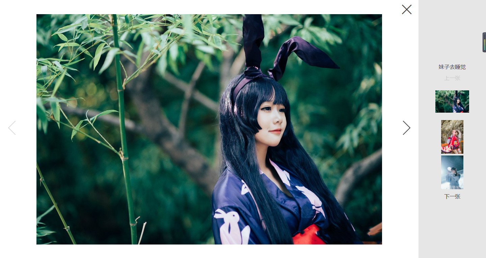

# vue-picture-preview

> 基于vue2.x的PC版图片预览组件



## 使用

```bash
npm i @nullxlren/vue-picture-preview --save
```

### vue

```javascript
import Vue from 'vue'
import VuePicturePreview from "@nullxlren/vue-picture-preview"
import "@nullxlren/vue-picture-preview/dist/vue-picture-preview.min.css"
Vue.use(VuePicturePreview);
```

```html
<!-- picture-preview -->
<picture-preview>
  <ul>
      <li v-for="(item,index) in list">
          <picture-preview-item :src="item.href" :title="item.title">
              {{item.href}}
          </picture-preview-item>
      </li>
  </ul>
</picture-preview>
```

```javascript
export default {
  name: 'app',
  data(){
      return {
          msg:"hello world",
          list:[
            {title:"妹子去睡觉",href:"https://ycg-1251509803.cossh.myqcloud.com/activity/works/avatar-1521115361957.jpg"},
            {title:"妹子去做饭",href:"https://ycg-1251509803.cossh.myqcloud.com/activity/works/avatar-1521115092303.jpeg"},
            {title:"妹子去换衣服",href:"https://ycg-1251509803.cossh.myqcloud.com/activity/works/avatar-1521115961751.jpg"},
            {title:"妹子去扫地",href:"https://ycg-1251509803.cossh.myqcloud.com/activity/works/avatar-1521114009969.jpg"},
            {title:"妹子去买零食",href:"https://ycg-1251509803.cossh.myqcloud.com/activity/works/avatar-1521114710785.jpg"}
          ]
      }
  }
}
```

## 功能

1. 支持键盘方向键

## Build Setup

``` bash
npm run serve
#启动开发服务器

npm run build
#构建代码
```
## 参数

### `picture-preview`参数

属性 | 说明 | 默认值
----------|--------|---------
is-pagination-enable | 是否显示翻页按钮 | Boolean/true
is-list-enable | 是否显示右侧列表 | Boolean/true

### `picture-preview-item`参数

属性 | 说明 | 默认值
----------|--------|---------
src | 图片url | String/""
disabled | 是否禁用 | Boolean/false
title | 图片标题 |  String/""
